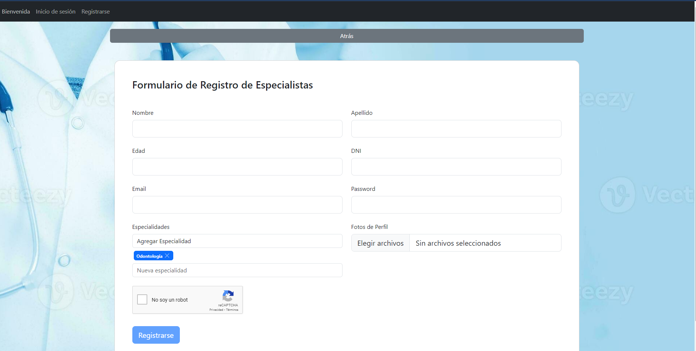

# Clínica Online Panduro

Página web diseñada para la gestión online de sacar turnos para nuestra clínica. Dentro de nuestra web vas a poder registrarte, iniciar sesión y solicitar turno. Para el apartado de Especialistas, los mismos van a poder gestionar sus propios turnos con sus pacientes. Y para la sección Administrador van a poder ver todas las estadísticas de nuestra clínica.

## Home
Esta sería la página de inicio.
 
## Inicio Sesión
Esta sería nuestra página de inicio de sesión con accesos rápidos.
 

## Registrarse
Esta sería nuestra página para registro para Pacientes y Especialistas. Desde la sección Administrador vamos a poder registrar Administradores y al mismo tiempo aceptar o rechazar especialistas. Todos los formularios cuentan con sus validaciones y reCAPTCHA para resolver y poder registrarse con éxito. Tener en cuenta que todos los usuarios deben verificar su correo electrónico y los usuarios con rol de Especialista deben poder ser aceptados por un Administrador.

 
 
 
 
 
 

## Perfiles
En todos los perfiles, nuestros usuarios van a poder visualizar su información y cerrar sesión.
- **Perfil para Paciente:** Dentro de este perfil, el especialista va a poder acceder a través de un botón con el símbolo de cuaderno para visualizar su historial clínico y hacer descargas en PDF de las mismas, ya sea eligiendo alguna especialidad o todas.
 
 
 

- **Perfil para Especialista:** Dentro de este perfil, el especialista va a poder acceder a través de un botón con el símbolo de calendario para asignar su disponibilidad horaria.
 
 
- **Perfil para Administrador.**
  

## Solicitar turno
El usuario con el perfil Paciente va a poder seleccionar un especialista, luego una especialidad y finalmente elegir el día, fecha y hora para el turno. 
 
 
 

El usuario con el perfil Administrador va a poder seleccionar un paciente y asignarle un turno.

 

## Mis Turnos
En esta sección vamos a poder visualizar todos los turnos de la clínica, pero algunos perfiles tendrán ciertos cambios.
- **Para el perfil Paciente:** Se podrá cancelar un turno si aún no fue aceptado o, en caso de ser aceptado y realizado, se podrá dejar una calificación y realizar una encuesta para el especialista.

- **Para el perfil Especialista:** Se podrá cancelar, rechazar, aceptar o finalizar un turno. Al finalizar, se debe llenar el historial clínico del paciente.

- **Para el perfil Administrador:** Se podrá visualizar todos los turnos.

## Secciones Ocultas
- **Para el perfil Administrador:** Tendremos la sección Usuarios, la cual nos permite descargar un Excel con la información de todos los usuarios y también el historial clínico de los pacientes.

- **Para el perfil Especialista:** Tendremos la sección Pacientes, la cual nos permitirá visualizar los últimos 3 turnos de cada paciente y a su vez poder ver el historial clínico del mismo.
  

## ESTADÍSTICAS
En esta sección vamos a poder visualizar las estadísticas de nuestra clínica. Ver una tabla de todos los inicios de sesión que se hicieron, la cantidad de turnos por especialidad, cantidad de turnos por día, cantidad de turnos solicitados por médico en un lapso de tiempo y la cantidad de turnos finalizados en un lapso de tiempo.

  
  
  
  
  

## Pipes y Directivas
Se usaron 3 Pipes, dos de ellos nos sirven para el filtro de cosas a la hora de buscar y el otro nos muestra los datos dinamicos a la hora de realizar el historial clinico del paciente.

Se usaron 3 usaron 3 directivas, uno para dar enter para que no apretemos el boton iniciar sesion en el login despues de poner neustro correo y contraseña.
El segundo para cambiar de color el estado del turno en la seccion Mis Turnos.
Por ultimo se uso una directiva que hace de tooltip, este se usa en la seccion Mi Perfil para sobre el boton del calendario y boton.

## Animaciones

Se usaron animaciones en la seccion Mis Turnos y la seccion oculkta Usuarios que solo puede acceder el administrador.

